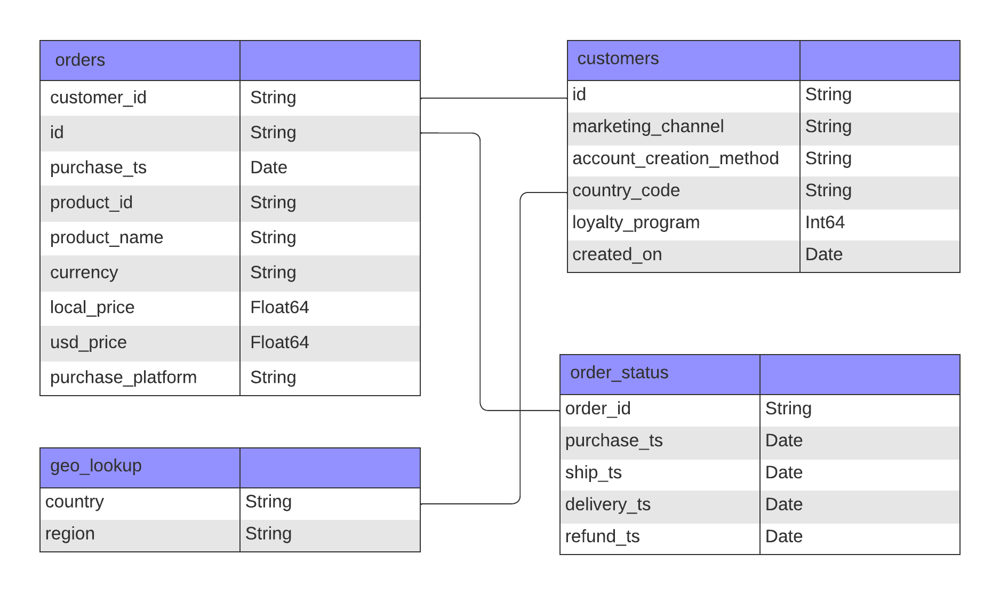

 
Founded in 2018, Elevate Electronics is an e-commerce company that curates and sells selective electronic products at a competitive price and has since rapidly expanded to a global customer base from 192 countries.<br />  
<br />
This project aims to:<br />  

  * Understand Elevate Electronics' performance during the period from 2019 to 2022, around the COVID-19 pandemic, and<br /> 
  * Deliver insights on improvements across the company including product, marketing, sales, and IT teams.<br />

**< Stakeholder Questions >**<br />

* What were the overall trends in sales during this time?<br />
* What were our monthly and yearly growth rates?<br />
* How was the new loyalty program performing? Should we keep using it?<br />
<br />

The key sales metrics used in this analysis were gross sales, average order value (AOV), and order count.<br /> 

**< Table of Contents >**  
* [About Data and Tools](https://github.com/jayoungs/PicoTech_Electronics_Pandemic_Sales_Analyasis/edit/main/README.md#about-data-and-tools)  
* [Executive Summary](https://github.com/jayoungs/PicoTech_Electronics_Pandemic_Sales_Analyasis/edit/main/README.md#executive-summary)  
* [Summary Insights](https://github.com/jayoungs/PicoTech_Electronics_Pandemic_Sales_Analyasis/edit/main/README.md#summary-insights)  
* [Deep Dive Insights on Underperformance in Q4 2022](https://github.com/jayoungs/PicoTech_Electronics_Pandemic_Sales_Analyasis/edit/main/README.md#deep-dive-insights-on-underperformance-in-q4-2022)  
* [Recommendations](https://github.com/jayoungs/PicoTech_Electronics_Pandemic_Sales_Analyasis/edit/main/README.md#recommendations-how-to-position-ourselves-unique-in-this-market)  
* [Caveats](https://github.com/jayoungs/PicoTech_Electronics_Pandemic_Sales_Analyasis/edit/main/README.md#caveats)  

## About Data and Tools

* The database structure, as seen below, consists of four tables: `orders`, `customers`, `geo_lookup`, and `order_status`. The main table for this analysis was consolidated from these four tables with a total of 108,127 records. 

<details>
<summary>ERD: Click to expand</summary> 

</details>
   
* Excel and SQL(BigQuery) were used for analysis and Tableau for visualization.

## Executive Summary
* Gross sales surged in 2020, the first year of the Covid-19 pandemic, with a peak at $1.3M and then declined gradually in 2021 and sharply in 2022 to the pre-pandeic level. AOV and order count also followed the similar trends, except for the fact that order count continued increasing in 2021. A granular examination of monthly trends reveals underperformance in Q4 2022 even compared to the pre-pandemic level.  
* The month-over-month sales growth rate was volitle each year, not limited to the pandemic years, and seaonally, decreases in February and October and increases in September, November, and December were noticeable.
* The most popular products were 27in 4K Gaming Monitor, Apple Airpods Headphone, and Macbook Air Notebook. On the other hand, Bose Soundsport Headphone and Apple iPhone failed to meet sales expectations.
* North America was the largest market in terms of both gross sales and order count while APAC's highest AOV and sales growth in 2020 suggests a strong underlying potential.
* loyalty:
* deeper insight son underperformance on q4 2022:
  
## Summary Insights

### **Overall Sales Trends:**


* **2020 surge in all sales metrics - gross sales, order count, and AOV**: especially the highest growth in gross sales and order count happened in March when the pandemic hit and people started buying electronics to set up their home offices or deal with the lockdown.
* **Post-2020 sales decline**: 
    * In 2021, gross sales and AOV started declining gradually, but order count momentum continued. This means that our customers placed more orders but for less expensive items compared to 2020.
    * In 2022, all metrics trended downwards to the **pre-pandemic level or potentially worse** across all products and regions.
* **Alarming Q4 2022 underperformance** compared to 2019 gross sales average: October 2022 marked the lowest growth rate of -55.2%, and the sales increase during the following holiday season was not sufficient enough to bounce back and reach at least the 2019 average level. Further analysis on Q4 2022 underperformance can be found [here](https://github.com/jayoungs/PicoTech_Electronics_Pandemic_Sales_Analyasis/edit/main/README.md#deep-dive-insights-on-underperformance-in-q4-2022).
* **Persistent MoM gross sales growth rate volatility and its possible link to seasonality**: both gross sales and order count showed a dip in February and October and a surge in September and during November and December. This surge seems related to the back-to-school season, Labor Day sales, and holiday season.

 
### **Product Segmentation:**


* **Products that failed to achieve sales expectations**:
   * **Bose Soundsport Headphones**, ever since it was brought into the product line in 2020, had had the highest negative growth rates in both gross sales and order count in the following two years, ending up with only one order in 2022. 
   * Surprisingly, **Apple iPhone** had underperformed despite its general popularity, only accounting for less than 1% in both gross sales and order count. The **lack of the product variation** might be the possible reason behind this. We sell only one model with one color and storage capacity option as opposed to 27in 4K Gaming Monitor and Apple Airpods Headphone with at least 14 options.

     | <ins><sub>Apple iPhone</sub></ins> | <sub>Bose Soundsport Headphones</sub> | <sub>Macbook Air Laptop</sub> | <sub>Lenovo ThinkPad Laptop</sub> | <sub>Samsung Webcam</sub> | <sub>Samsung Charging Cable Pack</sub> | <sub>27in 4K Gaming Monitor</sub> | <sub>Apple Airpods Headphones</sub> |
     |:---:|:---:|:---:|:---:|:---:|:---:|:---:|:---:|
     |<ins><sub>1</sub></ins>|<sub>2</sub>|<sub>5</sub>|<sub>5</sub>|<sub>7</sub>|<sub>8</sub>|<sub>14</sub>|<sub>16</sub>|

* **Product performance in Q4 2022** compared to the previous Q4: gross sales declined across all the products by a range of -51% (Lenovo ThinkPad Laptop) and -83% (Macbook Air Laptop).
  
### **Regional Segmentation:** 


* **Potential market opportunity in APAC**:
   * Customers in APAC purchased more expensive products, compared to those in the other regions.
   * APAC showed the highest sales growth rate of 226% in 2020.
   * APAC has the largest total population of 4.8 billion people among the four regions.
* **Regional performance in Q4 2022** compared to the previous Q4: gross sales declined across all the regions by a range of -68% (NA) and -82% (APAC).

### **Loyalty Program:** 


* Our loyalty program was introduced in 2019 for **customers who created accounts and fulfilled minimum purhcase frequency**.
* **Mixed performance trajectory**: after the first two years, loyalty members finally outperformed non-loyalty members in all the sales metrics for at least 17 months throughout 2021 and 2022. However, this trend reversed again in later months in 2022 with loyalty members experiencing a decline in performance across all metrics.
* **Unclear cause of the recent decline in loyalty member performance**:
   * The simultaneous decline in loyalty member performance and overall sales in Q4 2022 make it challenging to determine if the loyalty program itself was losing appeal or if its members were simply reflecting the broader market slowdown affecting all customer segments.
   * Loyalty members might simply have no other products left to buy from our limited variety of 8 different products.
* **Potential for impact**: The five-fold and twelve-fold growth in gross sales and order count respectively in 2020 indicate that the loyalty program, when effective, can significantly contribute to sales.
* We should **continue the loyalty program** for further observation and strategic refinement rather than discontinuing it prematurely.

### Customer Behavior Analysis


* Top 5 Customer Behavior in terms of order count
* how many registered customers? how many customers, registered or not, purchased? 

* purchase frequency:
* how many prodcuts did they buy?

## Deep Dive Insights on Underperformance in Q4 2022 

**Factor to consider**:  
Electronic products, such as gaming monitors and latops have **a long lifespan** of at least 3-5 years. Hence, to boost sales consistently, keeping **existing customers** engaged to revisiting and buy different products and attracting **new customers** are crucial. 

#### Hypothesis 1. Had existing customers been no longer active over time? - Yes
> Here, we define exiting customers as those **whoever placed at least one order** from 2019 to 2022, either as guests or members.
* **Long hiatus** between the last purchase date and January 1, 2023: 79% of customers hadn't made another purchase since at least 13 months ago.
  |**Hiatus Period**|**Number of Customers**|**Percentage**|
  |---:|---:|---:|
  |<ins>24+ months</ins>|39,600| <ins>45%</ins> |
  |<ins>13-24 months</ins>|29,500|<ins>34%<ins> |
  |7-12 months|12,186|14%|
  |4-6 months|4,111|5%|
  |0-3 months|2,231|3%|
* **Declining repeat purchase rate** over the years: 20% (2019) > 19% (2020) > 18% (2021) > 15% (2022).
* **Single-item purchase behavior**: 94.6% of our customers only purchased one unique product and 5.2% two unique products during this period.

    <details>
    <summary>SQL queries: Click to expand</summary> 
    
    ```sql
    
  -- calculate purchase hiatus
    WITH calculate_inactivity AS (
      SELECT customer_id,
        MAX(purchase_ts) AS latest_purchase,
        DATE_DIFF('2023-01-01', MAX(purchase_ts), MONTH) AS inactive_period
      FROM core.orders
      GROUP BY 1),
    aggregate_customer_num AS (
      SELECT (CASE 
        WHEN inactive_period <=3 THEN '0-3 months'
        WHEN inactive_period BETWEEN 4 AND 6 THEN '4-6 months'
        WHEN inactive_period BETWEEN 7 AND 12 THEN '7-12 months'
        WHEN inactive_period BETWEEN 13 AND 24 THEN '13-24 months'
        ELSE '24+ months'
        END) AS inactive_period_category,
        COUNT(customer_id) AS num_customers
      FROM calculate_inactivity
      GROUP BY 1
      ORDER BY 1)

    SELECT inactive_period_category,
      num_customers,
      SUM(num_customers) OVER () AS total_num,
      ROUND(100.00 * num_customers / SUM(num_customers) OVER (), 2) AS percentage
    FROM aggregate_customer_num
    ORDER BY 1;

    -- calculate repeat purchase rate per year
  WITH customers_per_year AS (
    SELECT 
      EXTRACT(YEAR FROM purchase_ts) AS year,
      COUNT(DISTINCT customer_id) AS total_num_customers
    FROM core.orders
    GROUP BY 1),
  repeat_purchase_customer AS (
    SELECT EXTRACT(YEAR FROM purchase_ts) AS year,
      customer_id,
      COUNT(DISTINCT id) AS order_count
    FROM core.orders
    GROUP BY 1, 2
    HAVING order_count >= 2)
  
  SELECT repeat_purchase_customer.year,
    total_num_customers,
    COUNT(DISTINCT customer_id) AS num_customer_repeat_purchase,
    ROUND(100.00 * COUNT(DISTINCT customer_id) / total_num_customers, 2) AS percentage
  FROM repeat_purchase_customer
  LEFT JOIN customers_per_year
    ON repeat_purchase_customer.year = customers_per_year.year
  GROUP BY 1, 2
  ORDER BY 1;
    
    -- the number of unique products customers purchased
    WITH cleaned_table AS (
      SELECT customer_id, 
        (CASE
        WHEN product_name LIKE "27%" THEN "27in 4K Gaming Monitor"
        WHEN product_name LIKE "bose%" THEN INITCAP(product_name)
        ELSE product_name
        END) AS product_name_cleaned
    FROM core.orders),
    product_per_customer AS (
      SELECT customer_id,
        COUNT(DISTINCT product_name_cleaned) AS num_unique_product_purchased
      FROM cleaned_table
      GROUP BY 1) 
    
    SELECT num_unique_product_purchased,
      COUNT(customer_id) AS num_customers
    FROM product_per_customer
    GROUP BY 1 
    ORDER BY 1 DESC;
    
    ```

#### Hypothesis 2. Had we had fewer new registered users over time? - Yes
> With the given data that does not contain orders made prior to 2019, it's not possible to determine new customers, registered or not, who made the first purchase for the period, 2019 - 2022. Given this limitation, this analysis simply focusd on newly **registered** users who created accounts 2019 - 2022 regardless of whether they made a purchase or not.

==(graphs showing both?)==
* The number of registrations had declined in an accelerated pace from 2021 to 2022, hitting low at 36 in December 2022.
* The number of registrations through our most successful channel, direct marketing, mirrored the similar pattern above with a plummet from March 2022 on. However,it's unclear that this downfall of registrations in late 2022 was related to direct marketing performance or visitors not appealed to sign up. Further investigation on marketing performance and customer journey is needed.
  
    <details>
    <summary>SQL queries: Click to expand</summary> 
    
    ```sql

    -- how many customers created accounts per year
    SELECT DATE_TRUNC(created_on, month) AS month,
      COUNT(DISTINCT id) AS unique_customer_count
    FROM core.customers 
    WHERE EXTRACT(YEAR FROM created_on) BETWEEN 2019 AND 2022
    GROUP BY 1
    ORDER BY 1;
    
    -- how would the results be different by marketing channel?
    WITH customers_cleaned AS (
      SELECT 
        id,
        COALESCE(marketing_channel, "unknown") AS marketing_channel_cleaned,
        created_on
      FROM core.customers
      WHERE EXTRACT(YEAR FROM created_on) BETWEEN 2019 AND 2022)
    
    SELECT marketing_channel_cleaned,
      DATE_TRUNC(created_on, month) AS month,
      COUNT(DISTINCT id) AS unique_customer_count
    FROM customers_cleaned
    GROUP BY 1, 2
    ORDER BY 1, 2;
    
    ```
    -- proportion of purchase between registered or guest.
#### funnel? - (visitoer) > who created accounts (lead, close to MQL) > purchased ((paying) customers > loyalty members

## Recommendations
#### Product Team
* Widen product variety:
  * Prepare **product upgrades** for our top-selling products, 27in 4K Gaming Monitors and Macbook Air Laptops, by conducting market research on what gaming monitors and Apple laptops are currently popular and could have the highest profitality.
  * Introduce new products 1) in **lower price range (under $500)** that customers could purchase with less hesitation and financial risk and/or 2) for **cross-selling**: e.g., gaming keyboards, gaming headsets, or (gaming) mouse.
    |<sub>**AOV Range**</sub>|<sub>**Products** (* Top 3 Products Underlined)</sub>|
    |:---|:---|
    |<sub>Under $100</sub>|<sub>Samsung Charging Cable Pack ($20), Samsung Webcam ($50)</sub>|
    |<sub>$100+</sub>|<sub>Bose Soundsport Headphones ($124), <ins>Apple Airpods Headphones ($160)</ins>, <ins>27in 4K Gaming Monitor ($421)</ins></sub>|
    |<sub>$500+</sub>|<sub>Apple iPhone ($741)</sub>|
    |<sub>$1000+</sub>|<sub>Lenovo ThinkPad Laptop ($1,100), <ins>Macbook Air Laptop ($1,588)</ins></sub>|
* Extend product variations for Apple iPhone in terms of models, colors, and storage capacity. 
* Discontinue Bose Soundsport Headphones.
  
#### Marketing Team
* Refine seasonal marketing strategies for the back-to-school season and holidays.
* Plan personalized promotions for product upgrade targeting customers who purchased gaming monitors and laptops in our first year.
* Launch a referral program to capitalize on our expanded customer base to acquire new customers.
* Map our customer journey to further understand their experience, pain points, and motivations behind their decisions by
  * Surveying customers after their purchase or people who didn’t buy, and/or
  * Using customers' website/app behavior and marketing email behavior.
* Further investigate on why our best marketing channel, direct marketing, failed to bring more new customers and invest more resources into it if necessary.
* Develop tailored promotions for registered users with low engagement based on the fact that:
  * Among customers who created accounts and then made a purchase later, only 13$ of them
      * 83% of customers who created accounts purchased products within three months, including 13% of those who did in less than one month.
      * 269 registered customers with no purchase history yet.   

* * Conduct customer research targeted for top customers and loyalty members to further surface insights on improvements and opportunities.

(* content creation to keep customers engaged: recommendation on how to maintain your appliance. create more vlaues.


#### Sales Team
* potential opportunity for business customers? who bought more than 3?) B2B? review our pricing strategies.
* * Top 5 Customer Behavior in terms of spend (untapped potential): each of them all purchased 3-4 laptops within 4 years. there might be a possibility that they were  small businesses. Investigate further to determine and develop B2B strategies.


## Caveats
* The main matric used in this analysis was sales revenue, not profits. Further analysis based on profits is recommended.
* * Check possible data integrity issues suggested in Caveats and improve data integrity.
2023-2024 data, profit data rather than sales, data quality (refund data for 2022)

## Tableau Interactive Dashboard
